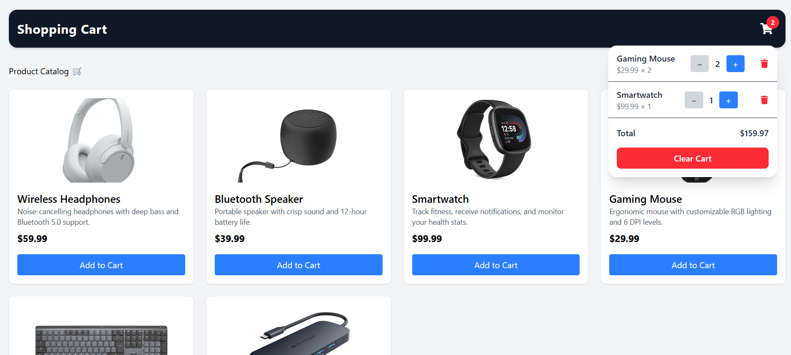

# 🛒 Shopping Cart React App

A simple and modern **Shopping Cart** application built with **React**, **Vite**, and **Tailwind CSS**.  
The app demonstrates product listing, cart management, and state handling using React Context.

🔗 **Live Demo:**  
https://shopping-cart-topaz-nu.vercel.app/

---

## 🚀 Features

- 📦 Product catalog loaded from a local JSON file
- ➕ Add products to cart
- ➖ Increase / decrease product quantity
- 🗑 Remove items from cart
- 🧹 Clear cart
- 💾 Cart persistence using `localStorage`
- 🎨 Clean and responsive UI with Tailwind CSS
- ✨ Smooth dropdown animation for cart preview

---

## 🛠 Technologies Used

- **React** (Context API, Hooks)
- **Vite**
- **Tailwind CSS**
- **React Icons**
- **Local JSON data**
- **Vercel** (deployment)

---

## 📦 Data Source

Products are loaded from a local static file:

/public/db.json

No external API or API key is required.

---

## 🌍 Deployment

The project is deployed on Vercel.

Live URL:
👉 https://shopping-cart-topaz-nu.vercel.app/

---

## 👤 Author

Created by Yuliia Pershina

GitHub: https://github.com/JuliyaPershina/shopping-cart

---

## 📌 Notes

This project is intended for learning and demonstration purposes:

React Context

State management

Component composition

Deployment workflow

⭐ If you like this project, feel free to star the repository!